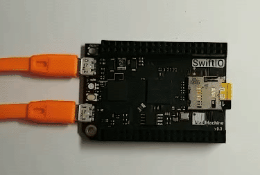

# BlinkTimer



This example shows how to use the timer and interrupt mechanism on the SwiftIO Board to make the on-board Red LED blinking at a constant frequency.

## What you need

* SwiftIO board

### Kits that meet the experimental conditions:

* [Maker Kit for SwiftIO](https://www.madmachine.io/product-page/maker-kit-for-swiftio)

## Circuit


Only the SwiftIO Board itself is required here. No extra shenanigans.

## Code

```swift
/// Change the LED state every second by setting the interrupt.

/// Import the library to enable the relevant classes and functions.
import SwiftIO

/// Initialize the red onboard LED and a timer to set interrupt.
let red = DigitalOut(Id.GREEN)
let timer = Timer()

/// Raise the interrupt to turn on or off the LED every second.
timer.setInterrupt(ms: 1000) {
    red.toggle()
}

while true {

}
```

## Instruction

### What is a timer?

Timer is precisely a part of the hardware on the SwiftIO board. It works just like an alarm clock, and it can be programmed by manipulation of some registers. You can set some parameters for the timer, which makes it trigger every so often.

### What is an interrupt?

An interrupt ensures that the processor responds quickly to some important events. When a interrupt signal is detected, the processor will stop its current job and perform some other codes, so that the board can react to the external signals quickly and accordingly.

### What happens in this example?

In this case, the timer is set to be the internal interrupt source, which is done by using `.setInterrupt(ms: )`, a method in the `Timer()` class. The parameter indicates that the timer triggers an interrupt every 1000 ms, or, every 1 s.

The `.toggle()` \(as the name implies\) method of DigitalOut class means that the output level of the specific pin is inverted. In this case, the red LED light will be switch on or off when the interruption happens.

You can also use the `sleep(ms: )` function to achieve the same effect. But this function will make the processor unresponsive during this period of time, making it not do anything. Therefore, the advantage of using `interrupt` is that the processor can still do other things between two toggles.

## See Also

* [Timer\(\)](https://swiftioapi.madmachine.io/Classes/Timer.html) - The Timer class is used to set the occasion to raise the interrupt.
* [toggle\(\)](https://swiftioapi.madmachine.io/Classes/DigitalOut.html#/s:7SwiftIO10DigitalOutC6toggleyyF) - To alternate between two voltage level.

## References

* [wiki: Timer](https://en.wikipedia.org/wiki/Timer)
* [wiki: Interrupt](https://en.wikipedia.org/wiki/Interrupt)
* [wiki: toggle](https://en.wiktionary.org/wiki/toggle)

