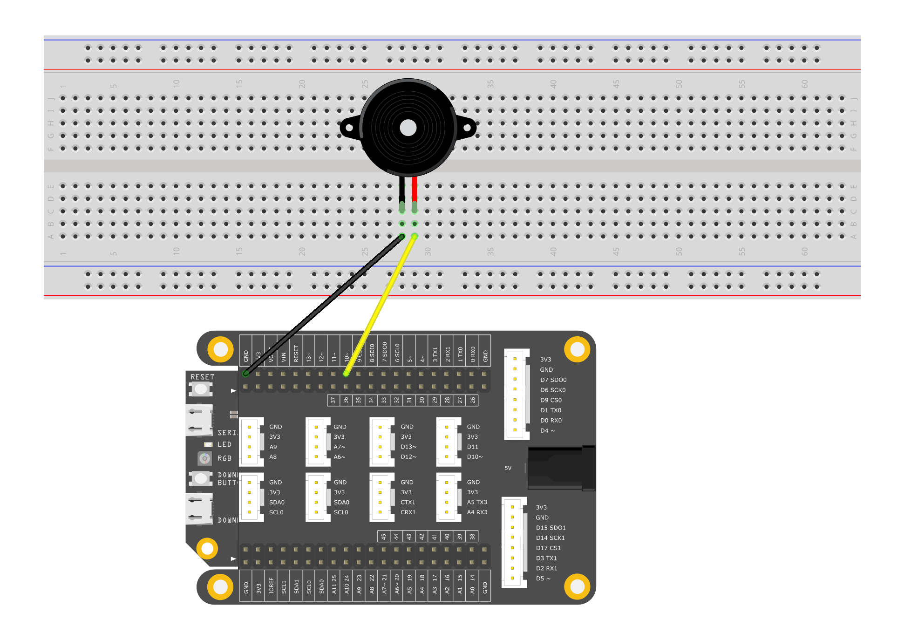

# PWMMelody


This example shows how to use the `PWMOut` to generate notes. It plays a little melody which you may have heard before.

## What you need

* SwiftIO board
* Jumper wires
* Piezo buzzer or a speaker
* SwiftIO shield \(optional\)

## Circuit



## Code

```swift
// Enable the speaker to play a simple melody by changing the frequency of PWM output.

// Import the library to enable the relevant classes and functions.
import SwiftIO

// Initialize a PWM output pin the speaker is connected to.
let speaker = PWMOut(Id.PWM2B)

// Specify several frequencies corresponding to each note of the melody. 
let fre = [
    350,350,393,441,
    441,393,350,330,
    294,294,330,350,
    350,330,330
]

/// Allow the speaker to repeat the melody again and again.
while true {
    for f in fre {
        // Change the frequency and the duty cycle of output to produce each note.
        speaker.set(frequency: f, dutycycle: 0.5)
        sleep(ms: 250)
    }
}
```

## Instruction

The code above uses a Frequency as musical pitches. For example, NOTE\_C4 is middle C, whose frequency is 262 Hz. Latter example MidiPlayer we will markdown all this musical note in a file. This file contains all the pitch values for typical notes. You may find it useful whenever you want to make musical notes.

## See Also

* [PWMOut](https://swiftioapi.madmachine.io/Classes/PWMOut.html) - The PWMOut class is used to change the time of high voltage during one period to simulate different output. 

## References

* [Frequency and Pitch](http://www.vias.org/crowhurstba/crowhurst_basic_audio_vol1_006.html)
* [Online Tone Generator](https://www.szynalski.com/tone-generator/)
* [wiki: Pitch \(music\)](https://en.wikipedia.org/wiki/Pitch_%28music%29)

