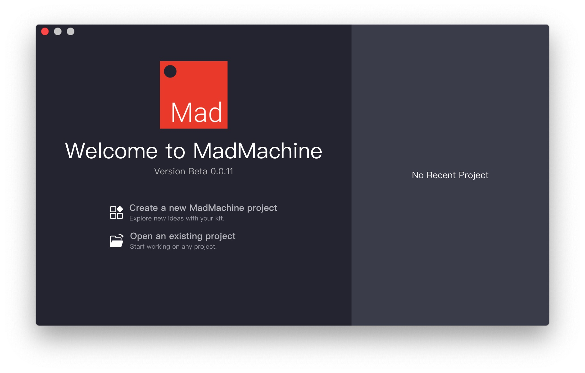
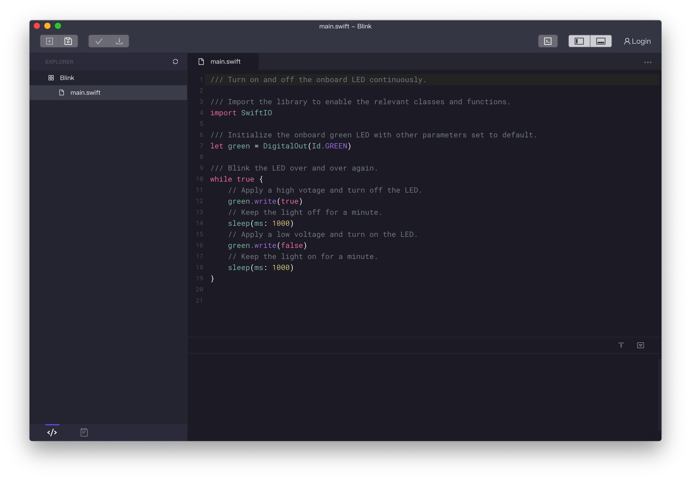
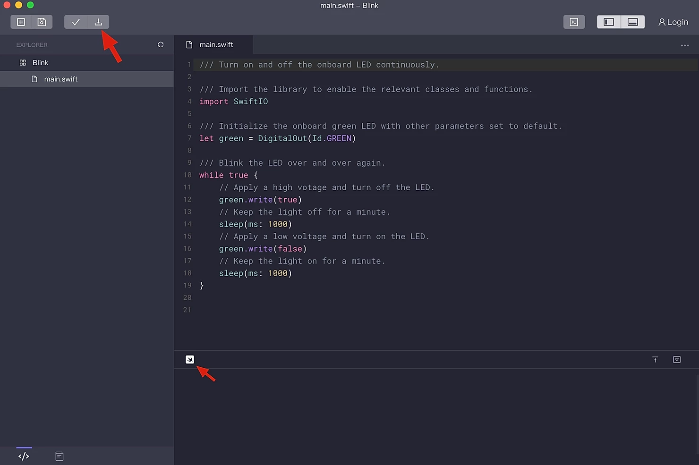

# Getting Started

Get your SwiftIO board? 🤣 Follow us step-by-step to realize your first project.

## \*\*\*\*🔸 **Step 1: Download and install the MadMachine IDE**

The MadMachine IDE provides you with an easy way to code. It is available on Windows and Mac now. 

So first of all, you need to download and install the MadMachine Software \(IDE\) to program your SwiftIO board. You'll find the latest software package here. 

* For Windows10 x64
* For Mac Os

Select the appropriate version according to your operating system. 

When you first open up the MadMachine IDE, it appears like this:

## \*\*\*\*🔸 **Step 2: Write code in the IDE**

 It's time to start your first project in the IDE 🥳 . 

Some read-only sample codes are offered in the IDE. You can copy them into a new project and see what's going on. 

Here is an simple example for your reference:

## \*\*\*\*🔸 **Step 3: Prepare SD card and confirm USB connection**

Make sure that you have inserted a SD card into the slot. 

Connect your SwiftIO board to your computer through the Download port using a Micro-USB cable. 

SwiftIO will simulate the device as a USB Flash Drive on your computer. 

The RGB LED will show you the current status of the USB communication: 

* Red: error
* Green: USB connection
* Blue: SD card detection

\*\*\*\*🔸 **Step 4: Build your code and download it to board**

Press the Download button to mount the device into your computer. 

An icon will appear in the status bar of  the IDE.

 __📌 _**Please note** any bad quality USB cable or some third-party USB hub will lead to connection failure._

Click the Download icon.

The IDE begins to build your code and then download it to the board if there is no error.

Wait a few seconds, you will see the USB flash drive is automatically removed.

And then, the onboard LED will blink✨ .  

