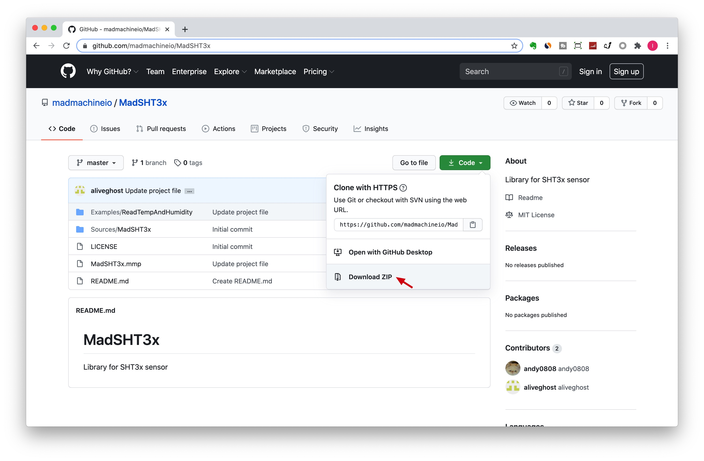
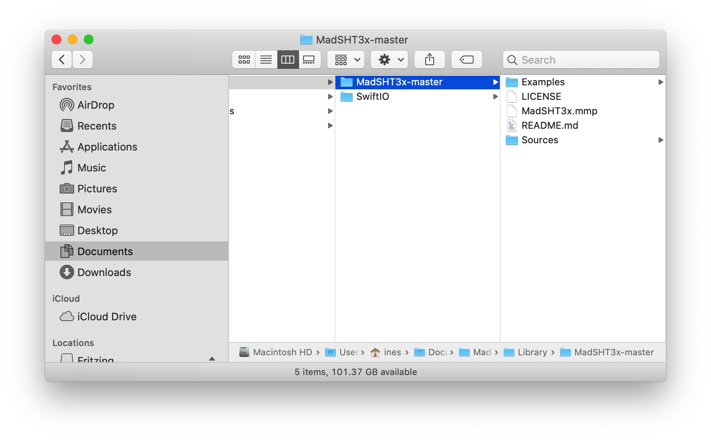
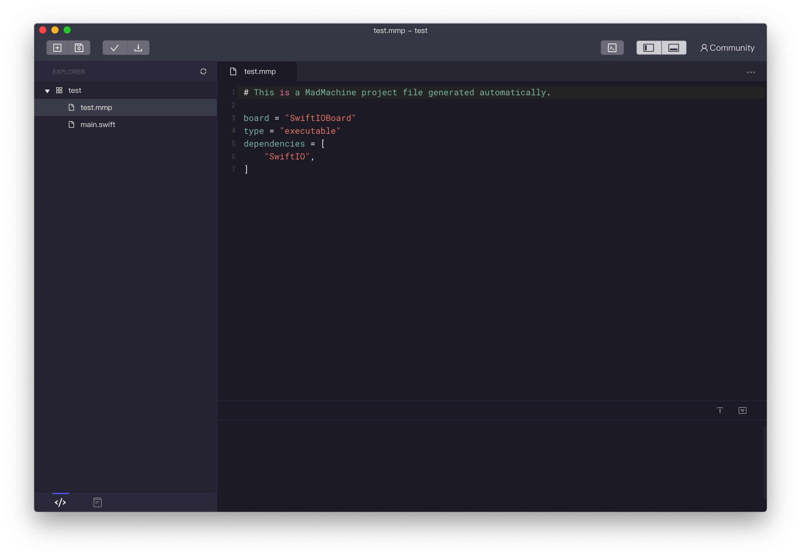

# Libraries

Libraries make your coding process more easily. With different libraries, you can control many modules using some simple methods.

## Install a library

Now let's learn how to install a library.

1.First, download the library from Github. ‌ I'll take the library MadSHT3x for example.

2.Enter the MadSHT3x. Select **Code** &gt; **Download ZIP**.

3.Unzip the package and move the folder to **Documents** &gt; **MadMachine** &gt; **Library**.

## Explore the examples in the library

There will be some examples in the library files downloaded from Github. Let's use it first before learning its usage.

1.Open the IDE. If you have opened it, please make sure close it and open it again. Then create a new project.

2.Click the  button on the bottom. You would notice the example MadSHT3x appears in the **Library** folder if you have successfully installed the library.

3.Double click the file **ReadTempAndHumidity**. A new window will pop up.

4.Build the files.

## Use library in your project

Now you are going to know how to apply new libraries in your own project.

1.Open the IDE. Create a new project.

2.In the file **.mmp**, add the library MadSHT3x in **dependencies**. ‌

3.Import the two libraries in **main.swift** file.

‌ Now you can use everything in the library to create your project.

